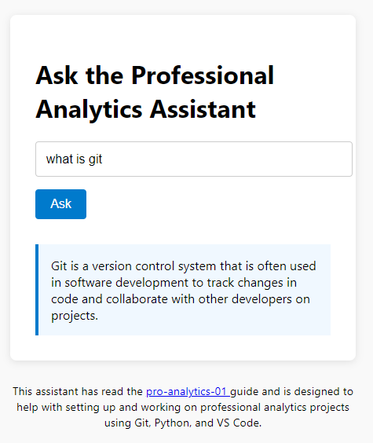

# pro-analytics-ai

This project demonstrates an OpenAI ChatGPT like project illlustrating the structure and implementation of a Retrieval-Augmented Generation (RAG) system built with Python, vector embeddings, and Large Language Models (LLM).

> Status: Runs locally, not yet hosted enabled for GitHub Pages access...

## Limited Focus

This assistant is trained on the [pro-analytics-01](https://github.com/denisecase/pro-analytics-01) guide and is designed to help with setting up and working on professional analytics projects using Git, Python, and VS Code.

## Notes: Use Python 3.11, Needs 0.5 GB 

ML tools work better on 3.11.
Some tools are very large (400 MB or more).

## On Windows, Do Everything in WSL

Open PowerShell, type `wsl` and hit return.
If setting up for the first time, be sure you can find your WSL username password - you will need it. 

## Create Repos folder and Clone

Create ~/repos folder: `mkdir -p ~/repos`

Clone your repo with `git clone your-repo-url`

Open in VS Code: `code .`

## Create a .venv and Install Dependencies

Open the project repository folder in VS Code. 
Open a new terminal (bash or zsh) (e.g. using the VS Code menu / Terminal / New Terminal) and run the following commands one at a time. 
For more info, see requirements.txt. 
Add `--timeout 100` to let each file take 100 seconds instead of default 15 seconds. 

```shell
sudo apt update
sudo apt install software-properties-common -y
sudo add-apt-repository ppa:deadsnakes/ppa -y
sudo apt install python3.11 python3.11-venv
python3.11 -m venv .venv
source .venv/bin/activate
python3 -m pip install --upgrade pip setuptools wheel
python3 -m pip install --upgrade -r requirements.txt --timeout 100
```

May need to rerun the last install command a couple times to get it all. 

## Get LLM API Key

1. Go to: https://openrouter.ai/
2. Click "Sign In" (top right). You can use Google, GitHub, or email
3. After logging in, go to: <https://openrouter.ai/account>
4. Scroll to the API Keys section
5. Click "Create Key". Name it `Pro-Analytics-AI` or something. Set amount to 1. 
6. Copy your new API key (it will start with or-)
7. Paste it into your .env file like this:

OPENROUTER_API_KEY=or-xxxxxxxxxxxxxxxxxxxx


## To Run the API Locally

```shell
sudo apt install uvicorn
```

To launch the backend:

```shell
uvicorn backend.A_api_interface.query_api:app --host 0.0.0.0 --port 8000 --reload
```
Keep the terminal open and don't use it for anything else while running the backend. 

To test it, open another terminal and run:

```shell
curl -X POST http://127.0.0.1:8000/query \
  -H "Content-Type: application/json" \
  -d '{"question": "What is git?"}'
```

Use CTRL C (multiple times as needed) to kill the process. 

## To Open a Front End

Install VS Code Extension Live Preview. 
In VS Code, right-click docs/index.html / Show Preview. 

## To test the app 

`python3 backend/main.py`

## Core Tools

- sentence-transformers - generating vector embeddings
- chromadb - local vector database storage
- openai -  querying GPT models (if enabled)
- fastapi, uvicorn -  API interaction (locally or in Lambda)
- fonttools - dependency needed for transformers and tokenizer backends
- loguru - used in utils/logger.py to output key information
- python-dotenv -  managing .env secrets


## Architecture

Front End

- Simple HTML/CSS/JS web app

Layered Backend

| Layer  | Responsibility      | Depends On   |
|--------|---------------------|--------------|
| A      | API Interface       | B only       |
| B      | Prompt + Query      | C            |
| C      | Retrieval           | utils only   |
| utils  | Logging / Config    | none         |


## LLM Source: Choose One

- OpenRouter	Open-source LLMs + OpenAI compatibility (free w/key)
- OpenAI API	Clean, reliable, simple for students (paid w/key)

Prices for GPT-3.5 are pretty affordable
- $0.0015 per 1,000 tokens (input)
- $0.002 per 1,000 tokens (output)

## Update Content As the Repo Changes

```shell
git clone https://github.com/denisecase/pro-analytics-01 backend/D_storage_layer/raw_docs/pro-analytics-01
rm -rf backend/D_storage_layer/raw_docs/pro-analytics-01/.git
rm -rf backend/D_storage_layer/raw_docs/pro-analytics-01/.vscode
rm -rf backend/D_storage_layer/raw_docs/pro-analytics-01/logs
```

This updates the content and deletes the .git folder and other unneeded parts from backend/D_storage_layer/raw_docs/pro-analytics-01.

## Current Status

Runs locally, not yet hosted.


| Feature                     | Description                                         |
|-----------------------------|-----------------------------------------------------|
| Frontend Input + Button     | Captures and sends question to the backend  |
| FastAPI Backend             | Handles POST requests, logs content        |
| Embedded Markdown Knowledge | Chunks & indexes repository content        |
| RAG + OpenRouter API   | Builds a prompt from relevant context and queries LLM |
| UI Response      | Displays answer in the interface      |

## Answers Change 

Answers will change. To get consistent responses, we can set the 'temperature' to zero. 

```python
response = client.chat.completions.create(
    model=model_name,
    messages=[{"role": "user", "content": prompt}],
    temperature=0.0
)
```

Since we haven't done that, responses will vary. For example:

- Git is a version control system.
- Git is a version control system that allows you to track changes in your code, collaborate with others, and manage your project's history effectively.
 

